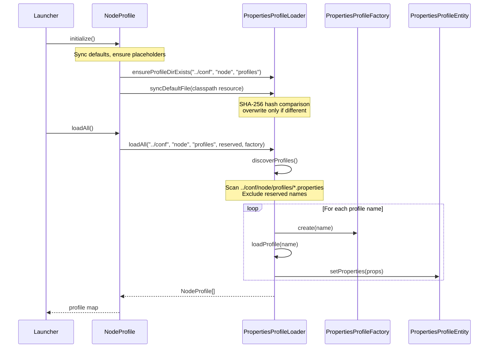

# Node Profile Loading - Complete Architecture

## Overview

This document describes the complete node profile loading mechanism, including configuration resolution, logging profiles, and how multiple node instances are bootstrapped from disk.

---

## Table of Contents

- [Properties Profile Loader](#properties-profile-loader)
- [Scope Distinction](#scope-distinction)
- [Configuration Resolution Flow](#configuration-resolution-flow)
- [Node Profile Discovery](#node-profile-discovery)
- [Logging Profile Loading](#logging-profile-loading)
- [Default File Synchronization](#default-file-synchronization)
- [Profile-to-Instance Mapping](#profileto-instance-mapping)
- [Troubleshooting](#troubleshooting)

---

## Properties Profile Loader

### Core Components

| Class | Package | Purpose |
|-------|---------|---------|
| `PropertiesProfileLoader` | `application.utils.config` | Centralized utility for `.properties`-based profile loading |
| `PropertiesProfileEntity` | `application.utils.config` | Interface for loadable properties-profile entities |
| `PropertiesProfileFactory<T>` | `application.utils.config` | Factory for polymorphic properties-profile creation |
| `NodeProfile` | `application.module.node.profile` | Concrete node profile implementation |

### Path Schema (Unified)

All module configurations follow a standardized path schema:

```
../conf/{module}/{category}/*.properties
```

| Component | Description | Example |
|-----------|-------------|---------|
| `{module}` | Module identifier | `node`, `database` |
| `{category}` | Profile category subdirectory | `profiles`, `logging` |

### Concrete Directory Structure

```
../conf/
└── node/
    ├── profiles/                              ← Node profile configurations
    │   ├── profile-default.properties         ← Default template (synced from resources via SHA-256)
    │   ├── mainnet.properties                 ← User profile: "mainnet"
    │   └── testnet.properties                 ← User profile: "testnet"
    │
    └── logging/                               ← Logging preset configurations
        ├── logging-default.properties         ← Default template (synced from resources via SHA-256)
        ├── minimal.properties
        ├── standard.properties
        └── verbose.properties
```

---

## Scope Distinction

### Properties-Based Profiles vs Other Formats

The `PropertiesProfileLoader` is **specifically designed** for Java `.properties` files (key=value format). It does NOT handle:

| Format | Used By | Loader |
|--------|---------|--------|
| `.properties` | `NodeProfile`, logging presets | `PropertiesProfileLoader` |
| JSON | `MariaDbProfile` (database) | Own JSON-based loader |
| XML | Future profiles | Dedicated XML loader |

This distinction ensures that each profile format has an appropriate, type-safe loading mechanism without forcing all profiles into a single format.

---

## Configuration Resolution Flow



---

## Node Profile Discovery

### How `NodeProfile.loadAll()` Works

| Step | Action | Source |
|------|--------|--------|
| 1 | Delegate to `PropertiesProfileLoader.loadAll()` | `NodeProfile.loadAll()` |
| 2 | Resolve directory: `../conf/node/profiles/` | `PPL.resolveProfileDir()` |
| 3 | List all `*.properties` files | `Files.list()` |
| 4 | Extract profile name from filename | `filename.substring(0, length - 11)` |
| 5 | Skip reserved names | `RESERVED_PROFILE_NAMES` set |
| 6 | Create `NodeProfile` instance | `PropertiesProfileFactory.create(name)` |
| 7 | Load properties from file | `PPL.loadProfile()` |
| 8 | Set properties on entity | `PropertiesProfileEntity.setProperties()` |

### Reserved Profile Names

The following profile names are **excluded** from discovery:

| Name | Purpose |
|------|---------|
| `profile-default` | Default property values (synced template, not a runnable profile) |
| `logging-default` | Default logging configuration template |

---

## Logging Profile Loading

### How `LoggingProfileManager` Works

| Step | Action | Source |
|------|--------|--------|
| 1 | Module registers provider via `LoggingModuleRegistry.registerProvider()` | `NodeLoggingProvider`, `DatabaseLoggingProvider` |
| 2 | Provider creates presets (minimal, standard, verbose, debug) | `ModuleLoggingProfile` instances |
| 3 | On profile init, `ProfileLoggingApplier.apply()` called | Via node startup |
| 4 | Preset resolved from node properties or default | `profile.getString("logging.preset")` |
| 5 | JUL LogManager reconfigured with preset values | `ProfileLoggingApplier.applyToJUL()` |

### Logging Configuration Files

```
resources/conf/
├── node/logging/logging-default.properties    ← Default logging levels for node module
├── database/logging/logging-default.properties ← Default logging levels for database module
└── system/logging/logging-default.properties   ← System-level defaults
```

---

## Default File Synchronization

### SHA-256 Hash-Based Sync

Default files (`profile-default.properties`, `logging-default.properties`) are automatically synchronized from classpath resources to the runtime `../conf/` directory:

| Condition | Action |
|-----------|--------|
| Target file **missing** | Copy from resources |
| Target file exists, hash **differs** | Overwrite (update detected) |
| Target file exists, hash **matches** | Do nothing |

### How It Works

```java
// Pseudocode:
String resourceHash = SHA256(classpathResource);
if (!file.exists(target)) {
    copy(resource, target);
} else if (SHA256(target) != resourceHash) {
    copy(resource, target);  // Update!
}
```

### Placeholder File Creation

Empty placeholder files (`node.properties`, `logging.properties`) are created **only** when no user profiles are discovered:

```java
int profileCount = PropertiesProfileLoader.countProfiles("../conf", "node", "profiles", reservedNames);
if (profileCount == 0) {
    // Create empty placeholders
}
```

---

## Profile-to-Instance Mapping

```mermaid
graph TD
    A[../conf/node/profiles/*.properties] -->|NodeProfile.loadAll()| B[NodeProfile[]]
    B -->|For each profile| C[Create NodeConsolePanel]
    C -->|ProfileLogger created| D[Subscribe to SystemLogger]
    C -->|ProfileLogger created| E[Subscribe ProfileConsoleSubscriber]

    F[SystemLogRouterHandler] -->|JUL events| G[SystemLogger]
    G -->|dispatch to all subscribers| H[SystemConsoleSubscriber]
    G -->|forward from ProfileLogger| I[ProfileConsoleSubscriber]

    subgraph "Per-Profile Isolation"
        D
        E
        I
    end

    subgraph "Global Aggregation"
        F
        G
        H
    end
```

---

## API Quick Reference

### PropertiesProfileLoader Methods

| Method | Description |
|--------|-------------|
| `resolveProfileDir(root, module, category)` | Resolves profile directory path |
| `discoverProfiles(root, module, category, reserved)` | Lists available `.properties` profile names |
| `countProfiles(root, module, category, reserved)` | Counts available profiles |
| `loadProfile(root, module, category, name)` | Loads single profile into Properties |
| `loadAll<T>(root, module, category, reserved, factory, type)` | Batch loads all `.properties` profiles |
| `syncDefaultFile(root, module, category, filename, resource)` | Syncs default file using SHA-256 |
| `ensureEmptyPlaceholderIfNoProfiles(...)` | Creates placeholders when needed |

### NodeProfile Methods

| Method | Description |
|--------|-------------|
| `loadAll()` | Load all node profiles from disk |
| `loadByName(String)` | Load specific profile by name |
| `discoverProfileNames()` | List available (non-reserved) profile names |
| `isReservedProfileName(String)` | Check if name is reserved |
| `initialize()` | Full init: sync defaults + placeholders |

---

## Troubleshooting

### Profile Not Loading?

1. **Check file exists**: Verify the `.properties` file is in `../conf/node/profiles/`
2. **Check reserved names**: Ensure the filename doesn't match reserved patterns (`profile-default`, `logging-default`)
3. **Check console output**: Look for `NodeProfile.loadAll()` debug logs
4. **Validate properties format**: The file must be a valid Java `.properties` format

### Logging Not Working?

1. **Check SystemLogRouterHandler installed**: Look for `[Bootstrap]` logs at startup
2. **Verify subscriber registered**: Check `SystemLogger.getInstance().getSubscriberCount()`
3. **Check logging preset**: Verify the profile has a valid `logging.preset` value
4. **Verify default files synced**: Check that `../conf/node/logging/logging-default.properties` exists

### Default File Not Updating?

1. **Check classpath resource**: Verify `/conf/node/profiles/profile-default.properties` exists in JAR
2. **Check hash comparison**: Default files are only overwritten when SHA-256 hash differs
3. **Manual override**: Delete the runtime file to force re-sync on next startup

---

## Related Documentation

- [`implementation_plan/unified_profile_loader.md`](../../implementation_plan/unified_profile_loader.md) - Unified Profile Loader implementation plan
- [`implementation_plan/multi_module_config_plan.md`](../../implementation_plan/multi_module_config_plan.md) - Multi-module config architecture
- [README.md](./README.md) - Node module overview