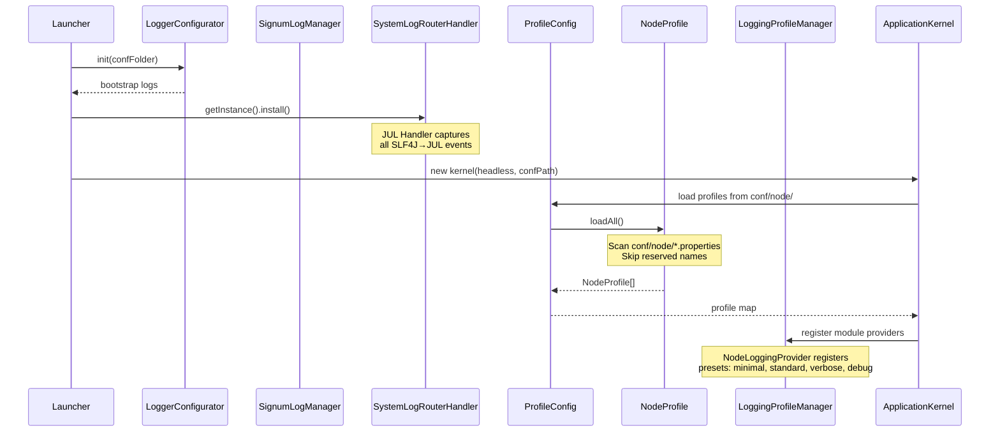

# Node Profile Loading - Complete Architecture

## Overview

This document describes the complete node profile loading mechanism, including configuration resolution, logging profiles, and how multiple node instances are bootstrapped from disk.

---

## Table of Contents

- [Configuration Resolution Flow](#configuration-resolution-flow)
- [Node Profile Discovery](#node-profile-discovery)
- [Logging Profile Loading](#logging-profile-loading)
- [Profile-to-Instance Mapping](#profileto-instance-mapping)
- [Troubleshooting](#troubleshooting)

---

## Configuration Resolution Flow



---

## Node Profile Discovery

### How `NodeProfile.loadAll()` Works

| Step | Action | Source |
|------|--------|--------|
| 1 | Check `conf/node/` directory exists | `NodeProfile.NODE_CONF_DIR` |
| 2 | List all `*.properties` files | `Files.newDirectoryStream()` |
| 3 | Extract profile name from filename | `filename.replace(".properties", "")` |
| 4 | Skip reserved names | `RESERVED_PROFILE_NAMES` set |
| 5 | Create `NodeProfile` instance | `new NodeProfile(profileName)` |
| 6 | Load properties from file | `profile.getProperties().load(inputStream)` |
| 7 | Add to list and return array | `profiles.toArray()` |

### Reserved Profile Names

The following profile names are **excluded** from discovery:

| Name | Purpose |
|------|---------|
| `node-default` | Default property values (not a runnable profile) |
| `logging-default` | Default logging configuration |

### File Location

```
conf/
└── node/
    ├── node.properties          ← defaults (reserved, not loaded as profile)
    ├── mainnet.properties       ← Profile: "mainnet"
    └── testnet.properties       ← Profile: "testnet"
```

---

## Logging Profile Loading

### How `LoggingProfileManager` Works

| Step | Action | Source |
|------|--------|--------|
| 1 | Module registers provider via `LoggingModuleRegistry.registerProvider()` | `NodeLoggingProvider`, `DatabaseLoggingProvider` |
| 2 | Provider creates presets (minimal, standard, verbose, debug) | `ModuleLoggingProfile` instances |
| 3 | On profile init, `ProfileLoggingApplier.apply()` called | Via `NodeProfileAdapter.initLogging()` |
| 4 | Preset resolved from node properties or default | `profile.getString("logging.preset")` |
| 5 | JUL LogManager reconfigured with preset values | `ProfileLoggingApplier.applyToJUL()` |

### Logging Configuration Files

```
resources/conf/
├── node/logging/logging-default.properties    ← Default logging levels for node module
├── database/logging/logging-default.properties ← Default logging levels for database module
└── system/logging/logging-default.properties   ← System-level defaults
```

---

## Profile-to-Instance Mapping

```mermaid
graph TD
    A[conf/node/*.properties] -->|NodeProfile.loadAll()| B[NodeProfile[]]
    B -->|For each profile| C[Create NodeConsolePanel]
    C -->|ProfileLogger created| D[Subscribe to SystemLogger]
    C -->|ProfileLogger created| E[Subscribe ProfileConsoleSubscriber]
    
    F[SystemLogRouterHandler] -->|JUL events| G[SystemLogger]
    G -->|dispatch to all subscribers| H[SystemConsoleSubscriber]
    G -->|forward from ProfileLogger| I[ProfileConsoleSubscriber]
    
    subgraph "Per-Profile Isolation"
        D
        E
        I
    end
    
    subgraph "Global Aggregation"
        F
        G
        H
    end
```

---

## Troubleshooting

### Profile Not Loading?

1. **Check file exists**: Verify the `.properties` file is in `conf/node/`
2. **Check reserved names**: Ensure the filename doesn't contain `-default` suffix
3. **Check console output**: Look for `NodeProfile.loadAll()` debug logs
4. **Validate properties format**: The file must be a valid Java `.properties` format

### Logging Not Working?

1. **Check SystemLogRouterHandler installed**: Look for `[Bootstrap]` logs at startup
2. **Verify subscriber registered**: Check `SystemLogger.getInstance().getSubscriberCount()`
3. **Check logging preset**: Verify the profile has a valid `logging.preset` value

---

## Quick Reference

| Class | Purpose | Key Method |
|-------|---------|-----------|
| `NodeProfile` | Represents single node config | `loadAll()`, `loadByName()` |
| `ProfileConfig` | Manages profile map | Constructor |
| `LoggingProfileManager` | Cross-module logging registry | `getPresets(moduleId)` |
| `ProfileLoggingApplier` | Applies preset to JUL LogManager | `apply(preset, logLevel)` |
| `SystemLogRouterHandler` | Bridges SLF4J→JUL→GUI | `install()` |